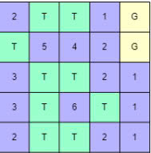

# Introduction to AI
Lab: Gem Hunter
# Gem Hunter - AI Lab

## Description
You are required to develop a gem hunter game using Conjunctive Normal Form (CNF). The game follows these rules:

- Players explore a grid to find hidden gems while avoiding traps.
- Each tile with a number represents the number of traps surrounding it (Number from 1 - 9).
- Your task is to formulate the problem as CNF constraints and solve it using logic.

   **Example Puzzle (Figure 1):**
   
  
### Steps to Solve the Problem:
1. Assign a logical variable for each cell in the grid:
   - **True (T):** The cell contains a trap.
   - **False (G):** The cell contains a gem.
2. **(Report)** Write constraints for cells containing numbers to obtain a set of constraint clauses in CNF (remove duplicate clauses).
3. **(Implement)** Generate CNFs automatically.
4. **(Implement)** Use the `pysat` library to find the value for each variable and infer the result.
5. **(Implement)** Program brute-force and backtracking algorithms to compare their speed (measuring running time and performance with using the library).
   - [Pysat Library](https://pysathq.github.io/)

## Submitted Documents
1. **Source Code**
   - The entire source code with running instructions.
   - A folder named `testcases` containing 3 input test cases and their corresponding 3 output files.
   - **Input Format:** Files must be named `input_x.txt` (where `x` is the input number).
   - **Output Format:** Files must be named `output_x.txt` (where `x` is the output number).
   
   **Symbols used:**
   - `T`: Traps
   - `G`: Gems (If a cell is determined not to be a trap, it is a gem)
   - `Number`: A numerical clue indicating the number of surrounding traps
   - `_`: Empty cell
   
   **Example:**
   **Input (`input_1.txt`):**
   3, _, 2, _
   _, _, 2, _
   _, 3, 1, _
   **Output (`output_1.txt`):**
   3, T, 2, G
   T, T, 2, G
   T, 3, 1, G

2. **Video Demo**
- A recorded demonstration of running the tests and showcasing the program results.

3. **Report**
- A detailed document covering:
  - Analysis and methodology
  - Steps in problem-solving
  - Performance comparisons
  - Estimation of completion levels for each requirement
  - References (if any)

## Requirements & Evaluation Criteria

| No. | Criteria | Score |
|----|------------------------------------------|------|
| 1 | Solution description (Logical principles for CNF generation) | 20% |
| 2 | Generate CNFs automatically | 10% |
| 3 | Use `pysat` library to solve CNFs correctly | 10% |
| 4 | Program brute-force algorithm (speed comparison) | 10% |
| 5 | Program backtracking algorithm (speed comparison) | 10% |
| 6 | Report quality (analysis, experiments, test cases, comparisons) | 40% |

### Additional Requirements:
- Provide at least 3 test cases of different sizes (5x5, 11x11, 20x20) to validate the solution.
- Ensure thorough analysis and comparison of results.

## Notice
- This is an **individual** exercise.
- The report must estimate the **completion level** for each requirement.
- AI tools are **not restricted**, but must be used **wisely**. Additional oral interviews may be conducted.
- **Plagiarism or academic dishonesty (copying from external sources without citation, fabricating data, submitting non-original work, or similarity over 70% with another submission) will result in ZERO points for the course grade.</span**
